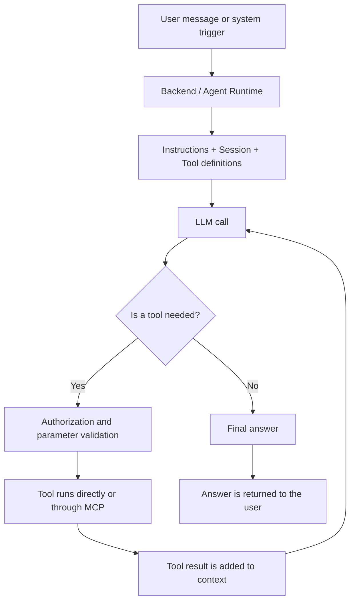

# Week 1: Fundamental Concepts and Introduction to Microsoft Agent Framework

> Last updated: August 5, 2026

## Table of Contents

- [How to Read This Document](#how-to-read-this-document)
- [What is an AI Agent?](#what-is-an-ai-agent)
- [What is an LLM (Large Language Model)?](#what-is-an-llm-large-language-model)
- [Key Features That Make AI Agents Powerful](#key-features-that-make-ai-agents-powerful)
- [Types of AI Agents](#types-of-ai-agents)
- [Differences Between Chatbots and AI Agents](#differences-between-chatbots-and-ai-agents)
- [Why an Agent Is Not Just a Prompt-Writing System](#why-an-agent-is-not-just-a-prompt-writing-system)
- [Core Components of Agent Architecture](#core-components-of-agent-architecture)
  - [Tool vs MCP vs Workflow](#tool-vs-mcp-vs-workflow)
  - [How Does an Agent Answer a User?](#how-does-an-agent-answer-a-user)
- [MCP (Model Context Protocol)](#mcp-model-context-protocol)
- [Microsoft Agent Framework](#microsoft-agent-framework)
- [Differences Between ChatGPT and Microsoft Agent Framework](#differences-between-chatgpt-and-microsoft-agent-framework)

## How to Read This Document

This document includes both a foundational path and deeper technical detail:

- **For the foundational explanation:** Focus on the AI agent definition, the difference from an LLM, the core architecture, the response flow, and Microsoft Agent Framework.
- **For deeper technical detail:** Continue with Transformer and self-attention, agent types, MCP transports and primitives, and workflow approaches.

For a spoken explanation, follow the foundational path and use the advanced sections as reference material for technical questions.

## What is an AI Agent?

An AI agent is a software system that interprets inputs, plans when needed, and uses tools defined for it in pursuit of a specific objective. It can make decisions and take actions within configured permissions, safety policies, and human-approval boundaries.

At their core, they are powered by Large Language Models (LLMs) and, when needed, supported by multimodal models to process multimodal data including text, audio, video, and code. However, traditional LLMs are static; they are limited to the data they were trained on. They cannot access live data or take autonomous action.

AI agents combine an LLM's language and reasoning capabilities with instructions and an execution loop. Tool/function calling, sessions and memory, or workflows can be added when the use case requires them. This lets the model retrieve information or act through external systems in a controlled way rather than only generate text.

**Tool Calling:** A model's structured request to invoke an available tool with specific parameters. The agent runtime or application layer performs the actual execution after the required validation and authorization checks.

## What is an LLM (Large Language Model)?

In its most basic definition, a Large Language Model (LLM) is a deep learning-based AI system trained on massive amounts of text data, capable of understanding and generating human-like language.

At their core, LLMs are massive statistical prediction machines. When a prompt is given to the model, it does not pre-plan the response. Using the language rules it has learned from its training data, it predicts the most appropriate next word (token) based on the context.

The word "large" refers to training on broad datasets and to the model having many mathematical parameters. Parameter count can affect capacity, but a larger model is not guaranteed to be more accurate or suitable for every task. Data quality, training method, context, tools, latency, and cost also matter.

### How LLMs Work

The underlying process of Large Language Models consists of multi-layered and complex stages, from raw data input to generating fluent text for the user.

#### Tokenization

Models cannot read words directly. Input texts (prompts) are broken down into small, meaningful pieces (words or syllables) called tokens, which the machine can process.

#### Embedding

Language models cannot read words; they can only perceive numbers. Therefore, the obtained tokens are converted into multi-dimensional numerical vectors called embeddings. Semantically similar words are positioned close to each other in this mathematical space.

#### Transformer and Self-Attention

At this stage, the transformer architecture and self-attention mechanism come into play.

Introduced in the 2017 paper "Attention Is All You Need" by Google researchers, the Transformer architecture is a neural network structure that forms the foundation of today's Large Language Models. It enables LLMs to understand and generate human language.

Older-generation AI systems had to process words sequentially, one by one — just like humans reading a book. This slowed down the system and made it difficult for the model to retain relationships between words at the beginning and end of a sentence.

The Transformer architecture solved this problem with two key innovations:

1. **Parallel Processing:** Instead of reading words sequentially, Transformers process the entire text or word sequence simultaneously, in parallel. This enabled models to be trained on massive amounts of data in much less time by fully utilizing the power of modern hardware.

2. **Self-Attention:** The biggest innovation of the Transformer architecture. Self-attention allows the model to simultaneously calculate which words are related to each other, regardless of the distance between them in a long sentence.

##### How It Works

When a question is given to the model, the Transformer breaks the text into tokens, then converts them into vectors. Through the self-attention mechanism, it extracts the contextual map of the entire sentence and the relationships between words. In the final step, it calculates and generates the most logical next word to add to the sequence based on this learned context.

The system uses learned statistical probabilities to predict the next most logical word to add to the sequence. The generated word is fed back into the system, and the process continues — predicting the next word — until the response is complete.

## Key Features That Make AI Agents Powerful

### Reasoning

The agent's ability to process input data and context through a logical filter to derive meaning.

Reasoning and tool-use loops let an agent evaluate the available context and choose an appropriate next step.

**ReAct (reason + act):** An approach that combines reasoning and action. The agent invokes a tool, observes the result, and chooses the next step based on that result.

It operates in cycles called: Think - Act - Observe. This allows agents to solve problems step by step, progressively improving their responses.

**Chain-of-Thought:** A general term for processing a complex problem through intermediate reasoning steps. A model's hidden reasoning does not need to be exposed verbatim to users or developers. Applications can instead make tool calls, tool results, and verifiable output summaries observable.

**In summary:** ReAct describes the action-and-observation loop with external tools. Reasoning helps choose the next step from the available context; it does not require publishing hidden internal reasoning.

### Planning

The agent creates a strategic plan to achieve a given complex goal, identifies necessary steps, and breaks actions down into smaller subtasks.

When faced with a complex problem, the agent does not try to solve it in a single step. It plans step by step and can modify its plan when encountering an obstacle.

### Tool/Function Calling

The agent stepping out of the static LLM world to interact with and leverage external resources.

### Memory

The ability of an agent system to store past interactions, user preferences, or intermediate task results and add them back to context when needed. Not every agent uses every type of memory; memory is designed according to the use case.

| Approach | What it stores | Typical use |
|---|---|---|
| **Short-term context** | Messages and intermediate results from the current conversation | Maintaining consistency within one session |
| **Persistent memory** | Confirmed preferences or information needed across sessions | Retrieving relevant information in later conversations |
| **Episodic memory** | Results and validated lessons from specific tasks | Referencing a past result in a similar task |
| **Shared memory** | Task state used by multiple agents | Multi-agent coordination |

This information is usually stored in relational, document, or vector databases. Instead of sending everything to the model, the application should add only information relevant to the current task.

### Autonomy

The ability of an agent to make some decisions without step-by-step human direction while operating within defined tools and policies. Autonomy does not mean unlimited authority: high-risk actions require authorization, validation, and often human approval.

## Types of AI Agents

AI agents are categorized by their capabilities, working structures, and forms of interaction with the user.

### By Capacity and Complexity Level

- **Simple Reflex Agents:** The simplest type of agent. They have no memory. They respond to the question "What do I see right now?" They do not interact with other agents and act based on predetermined rules driven only by current perceptions. They do not react to unexpected situations.

- **Model-Based Reflex Agents:** Using their current perceptions and memory, they can track the state of the outside world, building and updating an internal model of it. They have state management mechanisms and memory.

- **Utility-Based Agents:** They focus not just on reaching the goal but on how to reach it with the highest efficiency and utility. They operate a utility function. They make decisions based on fixed criteria defined in workflows.

- **Goal-Based Agents:** They have a defined goal. They explore sequences of actions and make plans to achieve the goal. This is where planning ability originates. The agent calculates alternative paths to the goal using search and planning algorithms.

- **Learning Agents:** They expand their knowledge by learning from new experiences on their own and improve their performance as they gain experience.

### By Interaction Type

Agents are divided into 2 types based on their ability to communicate with the user:

- **Interactive Agents:** Agents that communicate directly with the user, typically triggered by user input.

- **Autonomous Background Processes:** Agents that run in the background without direct input, triggered by events or tasks.

### By Working and Architectural Structure

- **Single Agents:** Independent agents that use external resources and tools on their own to achieve a specific goal. Suitable for tasks that do not require collaboration and have clearly defined boundaries.

- **Multi-Agent Systems:** Suitable for multi-step, large tasks and projects. Systems consisting of multiple agents that communicate with each other and combine their expertise for a common goal or competition.

## Differences Between Chatbots and AI Agents

"Chatbot" describes a conversational interface or application style, while "AI agent" describes a system that combines a model, tools, and an execution loop for a goal. The concepts are not mutually exclusive: a chatbot can be backed by an AI agent. The comparison below is between traditional rule-based chatbots and modern tool-using agent systems.

### Autonomy and Interaction Type

- **Traditional Chatbot:** Usually runs a predefined response or flow in reaction to user input.
- **AI Agent:** Can break down a goal and dynamically select among permitted tools within configured boundaries.

### Reasoning and Task Planning

- **Traditional Chatbot:** Follows rule-based or scripted conversation flows; dynamic task planning is limited.
- **AI Agent:** Can split a complex task into smaller steps and adjust the next step based on tool results.

### Memory, Learning, and Personalization

- **Traditional Chatbot:** Often does not retain persistent context across sessions.
- **AI Agent:** Depending on its design, it can use session history, persistent preferences, or shared task state. Adding memory does not mean the model automatically learns or always behaves correctly.

### Tool/Function Calling

- **Traditional Chatbot:** Usually responds within its predefined conversation flow.
- **AI Agent:** Can retrieve data or perform actions through tools explicitly provided and authorized by the application.

## Why an Agent Is Not Just a Prompt-Writing System

A prompt is only one of the inputs supplied to a model. An agent is a software system that manages model calls, tools, state, and safety controls in an execution loop.

- **Trigger:** An agent can be invoked by a user message, API request, scheduled job, or system event.
- **State:** It can preserve task state through sessions, conversation history, or persistent context providers.
- **Action:** It can interact with external systems in a controlled way through defined tools.
- **Loop:** The model returns text or a tool call; the tool result is sent back to the model until a final answer or configured limit is reached.
- **Boundaries:** The agent acts only within the authorization, validation, and approval rules defined by the application.

In summary, a prompt is an instruction given to a model; an agent is the software system that runs that instruction together with a model, tools, state management, and safety controls.

## Core Components of Agent Architecture

**Agent:** A system that manages model calls and, when needed, tool use for a specific objective. It can have a role, instructions, target, and permission boundaries.

**Tool:** A controlled function an agent can use to interact with the outside world and extend its capabilities. Tools can provide access to databases, web search, APIs, or other agents for current information or digital actions. The model requests a tool call; the agent runtime or application layer manages execution and security checks.

**Session and Memory:** A session associates messages and state within the same conversation or task. Persistent memory can store selected information across sessions and add it back to context when needed. Memory does not guarantee that the agent learns automatically or never repeats mistakes.

**Workflow:** A process whose steps, ordering, branches, and approval points are defined more explicitly by the developer. It can combine agents, ordinary functions, human input, and external systems.

**MCP:** An open protocol that gives AI applications a standard way to connect to tools and data sources exposed by external systems. It is not itself a tool and is not required for every agent.

**In summary:** A basic agent combines a model with instructions and an execution loop. Tools, session/memory, workflows, and MCP are added when the use case needs them.

> **Basic Agent = Model + Instructions + Execution Loop**
>
> **Optional: + Tools + Session/Memory + Workflow + MCP**

### Tool vs MCP vs Workflow

| Concept | Primary role | Who decides? | Required? |
|---|---|---|---|
| **Tool** | Provides a specific capability such as querying an order or creating a calendar event | The model can request it; the application checks permission and executes it | No |
| **MCP** | Provides standard client-server communication for tools, resources, and prompts | The Host manages the connection; the model can select an appropriate tool | No |
| **Workflow** | Organizes step order, branches, and approval points | Developers define the boundaries; an agent may decide within some steps | No |

In short: a **Tool is the capability**, **MCP is a standard way to connect to it**, and a **Workflow defines the order of the work.**

### How Does an Agent Answer a User?



1. A user message, API request, or system event triggers the agent.
2. The runtime sends the agent instructions, relevant session history, and available tool definitions to the model.
3. The model can answer directly or request a tool call with specific parameters.
4. If a tool is needed, the application validates authorization and parameters, then runs it as a normal function or through MCP.
5. The tool result is sent back to the model. The model either requests another tool or produces the final answer.
6. The runtime returns the answer and, depending on configuration, stores session state and observability records.

The model does not connect directly to a database or enterprise system. It requests a call; the application, agent runtime, or MCP Server performs the real access and security checks.

### Example: End-to-End Agent Flow

A walkthrough of an agent's steps when handling the request *"Schedule a meeting in Istanbul tomorrow and find me the best flight"*:

**1. Goal Analysis and Planning** — The agent receives the request and breaks the complex task into subtasks: (a) check calendar availability, (b) search for flights, (c) create the meeting.

**2. Observable Action Loop (Action - Observation - Next Step)**

```
Next step: Check the calendar before selecting a meeting time.
Action: check_calendar(date: "tomorrow", user: "me")
        → Connects to Calendar API via MCP
Observation: 09:00-11:00 is free, 14:00-15:30 is free

Next step: Search for Ankara-Istanbul flights that fit the available time.
Action: search_flights(departure: "Ankara", arrival: "Istanbul", date: "tomorrow")
        → Connects to Flight API via MCP
Observation: 3 flights found — 07:00 ($210), 10:00 ($340), 16:00 ($170)

Decision summary: The 07:00 flight is compatible with the available meeting slot.
Action: create_event(date: "tomorrow", time: "09:00-10:30", title: "Meeting")
        → Writes to Calendar API via MCP
Observation: Meeting created.
```

**3. Result** — The agent produces the following response for the user:

> *"I scheduled the meeting for 09:00-10:30 tomorrow. I found the 07:00 Ankara-Istanbul flight as a suitable option; it costs $210. I did not purchase the ticket."*

This example demonstrates multiple mechanisms working simultaneously in an AI agent:
- **Planning:** Breaking the task into subtasks
- **Tool Loop:** Action → Observation → Next Step
- **Tool Calling + MCP:** Connecting to external APIs (Calendar, Flight)
- **Session/Memory:** Adding conversation history or previously confirmed preferences to context when needed

## MCP (Model Context Protocol)

It can be compared to USB-C, which gives different devices a common connection standard. MCP gives AI applications a standard way to communicate with tools and data sources exposed by external systems.

A language model does not connect to a database, file system, or enterprise API by itself. The application layer provides those capabilities. MCP creates a standard communication layer between the application and a tool or data source.

With MCP, different tools can be exposed through a common protocol instead of requiring a different integration shape for every application. An agent can retrieve current data or perform permitted actions. MCP does not guarantee correctness or eliminate hallucinations.

### Core Architecture and How It Works

It consists of 3 main components:

**MCP Host:** The layer where the model and user interact. It hosts the LLM and the interface the user interacts with. It runs one or more MCP Clients in the background.

**MCP Client:** Runs inside the Host and manages a connection to a specific MCP Server. During initialization it negotiates the protocol version and supported capabilities, then lists exposed tools, resources, and prompt templates and carries requests between the Host and Server.

**MCP Server:** A service that exposes tools, resources, or reusable prompt templates through MCP. It can run as a local process or over a network; the server performs the actual interaction with its underlying API, file system, or database.

### Transport Layer

Communication between the MCP client and server uses JSON-RPC messages. The current specification defines two standard transport methods:

**Stdio (Standard Input/Output):** The client usually launches the MCP server as a subprocess on the same machine. JSON-RPC messages travel over standard input and output. It is suitable for local integrations such as development tools and file systems. Local execution alone is not a security guarantee; process permissions still need to be restricted.

**Streamable HTTP:** The MCP server runs as an independent service and clients connect to a single HTTP endpoint. Client messages are sent through HTTP POST; the server can return a normal JSON response or optionally use Server-Sent Events (SSE) for streaming. It is suitable for remote and multi-user services. Authentication, authorization, `Origin` validation, and secure network configuration must be implemented separately.

The older **HTTP+SSE** transport from protocol version `2024-11-05` was replaced by **Streamable HTTP**. Backward compatibility can still be provided for older clients and servers.

#### Stdio vs Streamable HTTP Comparison

| Feature | Stdio | Streamable HTTP |
|---|---|---|
| **Resource Location** | Local (machine-internal) | Remote (network/internet) |
| **Communication Type** | JSON-RPC over standard input/output | HTTP POST/GET; optional SSE streaming |
| **Execution Model** | Local subprocess launched by the client | Independent server that can serve multiple clients |
| **Security** | Depends on operating-system process and file permissions | Requires authentication, authorization, and `Origin` validation |
| **Scalability** | Single-machine only | Accessible by multiple applications |
| **Use Case** | Local file system, database, IDE | Remote APIs, cloud services |

### MCP Primitives

MCP provides three fundamental building blocks for agents to interact with the outside world:

- **Tools:** Functions the model can select based on context and the MCP Server executes. They define actions such as running a database query, fetching weather data, or creating a file. The Host can require permission or human approval before execution.

- **Resources:** Readable context such as file contents, schemas, documentation, or records. The server lists them, while the Host application usually controls which resources are added to context.

- **Prompts:** Reusable instruction templates defined on the server side. They typically help a user initiate a standardized task.

**In summary:** Tools provide agents with **action** capability, Resources provide **information** sources, and Prompts provide **ready-made instruction** templates.

### What It Provides and Why It Matters

- Can reduce reliance on training data and lower hallucination risk by providing controlled access to current or enterprise data; it does not guarantee correctness.
- Lets tools and data sources be exposed to different AI applications through a common protocol.
- Can reduce development effort and integration complexity through reusable connections.
- Reduces coupling between application, model, and tool layers, but does not guarantee model or infrastructure changes will require no code changes.

## Microsoft Agent Framework

Microsoft Agent Framework is an open-source, multi-language development framework for building, orchestrating, observing, and running AI agents and multi-agent workflows in production. Its primary ecosystems are .NET and Python; Go support is in public preview.

The framework brings model clients, instructions, tools, sessions, persistent context, middleware, and workflows under a common programming model.

Its goal is to support applications that go beyond one-off, stateless model calls by interacting with external systems in a controlled way, managing multi-step tasks, and addressing production requirements.

### Relationship with Semantic Kernel and AutoGen

Microsoft Agent Framework is a new foundation developed using experience from the AutoGen and Semantic Kernel teams. Rather than describing it as a literal merger of two packages or as "Semantic Kernel 2.0," it is more accurate to view it as an evolution of ideas from those projects into a production-oriented common programming model.

**AutoGen** introduced influential agent and multi-agent orchestration concepts. Microsoft publishes an official migration guide for moving existing AutoGen projects to Agent Framework.

**Semantic Kernel** provided important foundations for model clients, tool integration, and enterprise application patterns. Semantic Kernel and Agent Framework are separate projects; support and migration decisions should be verified against official documentation for the versions and requirements in use.

### Core Architectural Components

Agents and Workflows sit at the center of the framework, supported by sessions, context providers, middleware, hosting, and observability:

**Agents:** Combine a model client with instructions, tools, and an execution loop. They are useful for open-ended or conversational tasks where tool selection depends on context.

**Workflows:** Connect multiple agents, human interactions, and external systems in a graph-based structure for multi-step tasks. Used when tasks have clear steps and precise control over execution order is required.

**Sessions and Context Providers:** Manage conversation history, task state, and persistent context when needed. A session alone does not guarantee durable storage; appropriate history/context providers and storage must be configured.

**Agent Harness:** Bundles capabilities for long-running, multi-step tasks, including the tool-calling loop, context management, plans and todo tracking, file access, observability, and tool approval.

**Hosting:** Runs an agent or workflow in a web application, service, or container and exposes it through an application interface.

#### Workflow Approaches

Programmatic workflows connect executors and the message routes between them as edges in a directed graph. The framework provides orchestration patterns such as sequential, concurrent, handoff, and group collaboration. Because supported APIs and declarative options can vary by SDK language and version, implementation details should be checked against the current official documentation.

### MCP Support

MAF supports connecting agents to tools and resources exposed by MCP servers. Security is not automatic: authentication, authorization, and tool permissions must be configured by the application.

### Enterprise-Ready Production Features

Key capabilities for moving agents from prototype to production include:

**Checkpointing:** Prevents long-running processes from being lost entirely. The system saves its current state, allowing the process to be recovered and resumed from where it left off.

**Observability:** Removes the "black box" nature of agent actions by providing distributed tracing and debugging capabilities.

**Middleware:** Allows custom pipelines to be created between agent requests and responses, making error handling and security management easier.

**Human-in-the-Loop (HITL):** Built-in mechanisms that automatically pause workflows before critical decisions and wait for human approval or input.

## Differences Between ChatGPT and Microsoft Agent Framework

This compares a product with a software development framework. Because features vary by plan, version, and configuration, categorical statements such as "ChatGPT cannot use tools" or "ChatGPT has no memory" are not accurate.

### Purpose
ChatGPT is a hosted product used by end users for conversation, content generation, research, and supported tool-based tasks. Microsoft Agent Framework is an SDK/framework for developers building custom agents and workflows into their own applications.

### Control and Customization
The models, apps, tools, memory, and agent features available in ChatGPT depend on product options and workspace policies. With MAF, developers configure the model provider, instructions, tools, middleware, sessions, workflows, storage, and hosting architecture.

### Execution and Hosting
OpenAI manages ChatGPT's product environment and infrastructure. For a MAF application, the developer or organization is responsible for the API, service or container, identity, data storage, monitoring, and deployment.

### Tools, Memory, and Agent Features
Depending on plan and configuration, ChatGPT can provide apps, tools, memory, and reusable agent experiences. MAF provides tools, MCP, sessions, context providers, workflows, and multi-agent orchestration, which developers assemble according to their own security and business rules.

### Use Case
Choose ChatGPT when a ready-to-use AI product fits the need. Consider Microsoft Agent Framework when developer control over application code, business rules, integrations, and deployment architecture is required.

| Feature | ChatGPT | Microsoft Agent Framework |
|---|---|---|
| **Type** | Hosted end-user product | Open-source development framework |
| **Configuration** | Options exposed by the product and plan | Application architecture controlled by developers |
| **Tools and Data** | Apps and connections supported by the product | Custom functions, MCP, and enterprise integrations |
| **State/Memory** | Depends on product settings and plan | Configured with sessions and context/history providers |
| **Workflow** | Task and agent experiences provided by the product | Code-defined workflows and multi-agent orchestration |
| **Hosting** | Managed by OpenAI | Managed by the developer or organization |

## References & Further Reading

- [Microsoft Agent Framework (GitHub)](https://github.com/microsoft/agent-framework)
- [Microsoft Agent Framework — Get Started](https://learn.microsoft.com/en-us/agent-framework/get-started/)
- [Microsoft Agent Framework — Agent Harness](https://learn.microsoft.com/en-us/agent-framework/agents/harness)
- [Microsoft Agent Framework — AutoGen Migration Guide](https://learn.microsoft.com/en-us/agent-framework/migration-guide/from-autogen/)
- [Semantic Kernel (Microsoft)](https://learn.microsoft.com/en-us/semantic-kernel/)
- [AutoGen (Microsoft Research)](https://github.com/microsoft/autogen)
- [Model Context Protocol (MCP) — Getting Started](https://modelcontextprotocol.io/docs/getting-started/intro)
- [Model Context Protocol (MCP) — Transports](https://modelcontextprotocol.io/specification/2025-06-18/basic/transports)
- [Apps in ChatGPT](https://help.openai.com/en/articles/11487775/connectors-in)
- [Memory FAQ — ChatGPT](https://help.openai.com/en/articles/8590148-memory-faq.)
- [What Are Large Language Models? (IBM)](https://www.ibm.com/think/topics/large-language-models)
- [What is a Large Language Model? (Stanford HAI)](https://hai.stanford.edu/ai-definitions/what-is-a-llm)
- [What Are AI Agents? (Google Cloud)](https://cloud.google.com/discover/what-are-ai-agents)
