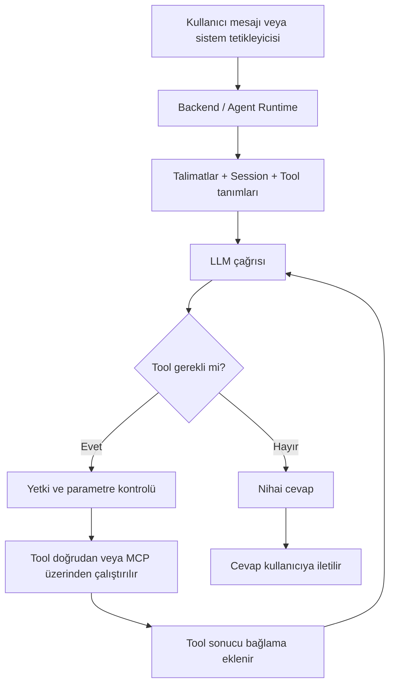

# Hafta 1: Temel Kavramlar ve Microsoft Agent Framework'e Giriş

> Son güncelleme: 5 Ağustos 2026

## İçindekiler

- [Dokümanı Nasıl Okumalı?](#dokümanı-nasıl-okumalı)
- [AI Agent Nedir?](#ai-agent-nedir)
- [LLM (Büyük Dil Modeli) Nedir?](#llm-büyük-dil-modeli-nedir)
- [AI Ajanlarını Güçlü Kılan Temel Özellikler](#ai-ajanlarını-güçlü-kılan-temel-özellikler)
- [AI Ajan Türleri](#ai-ajan-türleri)
- [Chatbot ile AI Agent Arasındaki Farklar](#chatbot-ile-ai-agent-arasındaki-farklar)
- [Agent Neden Sadece Prompt Yazan Bir Sistem Değildir?](#agent-neden-sadece-prompt-yazan-bir-sistem-değildir)
- [Agent Mimarisinin Temel Parçaları](#agent-mimarisinin-temel-parçaları)
  - [Tool, MCP ve Workflow Farkı](#tool-mcp-ve-workflow-farkı)
  - [Agent Kullanıcıya Nasıl Cevap Verir?](#agent-kullanıcıya-nasıl-cevap-verir)
- [MCP (Model Context Protocol)](#mcp-model-context-protocol)
- [Microsoft Agent Framework](#microsoft-agent-framework)
- [ChatGPT ile Microsoft Agent Framework Arasındaki Farklar](#chatgpt-ile-microsoft-agent-framework-arasındaki-farklar)

## Dokümanı Nasıl Okumalı?

Bu doküman hem temel anlatımı hem de ileri teknik ayrıntıları içerir:

- **Temel anlatım için:** AI Agent tanımı, LLM ile farkı, Agent mimarisinin temel parçaları, Agent'ın cevap üretme akışı ve Microsoft Agent Framework bölümleri yeterlidir.
- **İleri teknik ayrıntı için:** Transformer ve self-attention, ajan türleri, MCP taşıma katmanı ve primitifleri ile workflow yaklaşımları incelenebilir.

Konuyu sözlü anlatırken temel akışı takip etmek, ileri bölümleri ise gelebilecek teknik sorular için başvuru kaynağı olarak kullanmak daha uygundur.

## AI Agent Nedir?

AI Agent; belirli bir hedef doğrultusunda girdileri yorumlayan, gerektiğinde planlama yapan ve kendisine tanımlanan araçları kullanabilen yazılım sistemidir. Belirlenen izinler, güvenlik kuralları ve insan onayı sınırları içinde karar alabilir ve eylem gerçekleştirebilir.

Temelinde Büyük Dil Modellerini (LLM) barındırır ve gerektiğinde multimodal modeller ile desteklenerek metin, ses, video, kod gibi çok modlu verileri işleyebilir. Ancak geleneksel LLM'ler statiktir; yalnızca eğitildikleri veriler ile sınırlıdırlar. Canlı veri veya otonom eyleme geçemezler.

AI Agent'lar ise LLM'in dil ve akıl yürütme yeteneklerini talimatlar ve bir çalışma döngüsüyle birleştirir. İhtiyaca göre araç çağırma (tool/function calling), oturum ve hafıza (memory) ya da iş akışları (workflow) eklenebilir. Böylece model, yalnızca metin üretmenin ötesine geçerek kontrollü biçimde dış sistemlerden bilgi alabilir veya işlem yapabilir.

**Tool Calling:** Modelin, tanımı kendisine sunulan bir aracın belirli parametrelerle çağrılmasını istemesidir. Gerçek aracı Agent runtime veya uygulama katmanı, gerekli doğrulama ve yetki kontrollerinden sonra çalıştırır.

## LLM (Büyük Dil Modeli) Nedir?

Büyük Dil Modelleri (LLM) en temel tanımıyla devasa miktarda metin verisi kullanılarak eğitilmiş ve insan benzeri dili anlayıp üretebilen derin öğrenme tabanlı yapay zeka sistemleridir.

LLM'ler aslında işin özünde devasa birer istatistiksel tahmin makineleridir. Modele bir prompt verildiğinde model bunu önceden kurgulamaz. Eğitiminde kullanılan metinler sayesinde öğrendiği dil kurallarını kullanarak bağlama en uygun şekilde, bir sonraki kelimenin (token'ın) ne olması gerektiğini tahmin eder.

İsmindeki "büyük" kelimesi, geniş veri kümeleriyle eğitilmesini ve modelin çok sayıda matematiksel parametreye sahip olmasını ifade eder. Parametre sayısı model kapasitesini etkileyebilir; ancak daha büyük bir modelin her görevde daha doğru veya daha uygun olacağı garanti değildir. Veri kalitesi, eğitim yöntemi, bağlam, araçlar, gecikme ve maliyet de sonuç üzerinde etkilidir.

### LLM Çalışma Süreci

Büyük Dil Modellerinin arka plandaki çalışma süreci, ham verinin alınıp kullanıcının karşısına akıcı bir metin olarak çıkmasına kadar uzanan çok katmanlı ve karmaşık aşamalardan oluşur.

#### Tokenization

Modeller kelimeleri doğrudan okuyamaz. Girilen metinler (promptlar) token adı verilen, makinenin algılayabileceği küçük, anlamlı parçalara (kelime veya hece) bölünür.

#### Embedding

Dil modelleri kelimeleri okuyamaz, sadece sayıları algılayabilir. Bu nedenle elde edilen token'lar, "embedding" adı verilen çok boyutlu sayısal vektörlere dönüştürülür. Anlamca birbirine benzeyen kelimeler matematiksel uzayda birbirlerine yakın konumlandırılırlar.

#### Transformer ve Öz-Dikkat (Self-Attention)

Bu aşamada devreye transformer mimarisi ve öz-dikkat (self-attention) girer.

2017 yılında Google araştırmacıları tarafından yayınlanan "Attention Is All You Need" isimli makaleyle tanıtılan Transformer mimarisi günümüzdeki Büyük Dil Modellerinin temelini oluşturan bir sinir ağı yapısıdır. Büyük Dil Modellerinin insan dilini anlamasını ve üretmesini sağlar.

Eski nesil yapay zeka sistemleri bir metni okurken kelimeleri tıpkı insanların kitap okuduğu gibi sırayla, sekansiyel olarak işlemek zorundaydı. Bu durum hem sistem hızını yavaşlatıyor hem de modelin cümle başındaki bir kelimenin cümle sonundaki bir kelimeyle olan ilişkisini akılda tutmasını zorlaştırıyordu.

Transformer mimarisi bu sorunu iki aşama ile ortadan kaldırdı:

1. **Paralel İşleme:** Transformerlar kelimeleri sırayla okumak yerine metnin veya kelime dizisinin tamamını aynı anda, paralel olarak işler. Bu durum modellerin yeni donanımlı cihazlarda cihazın gücünü tam kapasite kullanarak devasa miktardaki verilerle çok daha kısa sürede eğitilebilir hale getirmiştir.

2. **Öz-Dikkat (Self-Attention):** Transformer mimarisinin en büyük inovasyonudur. Öz-dikkat modelin uzun bir cümleyi okurken aralarında ne kadar mesafe olursa olsun hangi kelimelerin birbiriyle ilişkili olduğunu eşzamanlı olarak hesaplamasını sağlar.

##### Nasıl Çalışır?

Modele bir soru sorulduğunda transformer, metni makinenin algılayabileceği gibi "token" adı verilen küçük parçalara, ardından da vektörlere dönüştürür. Sonra öz-dikkat mekanizması sayesinde tüm cümlenin bağlam haritasını ve kelimeler arası ilişkileri çıkarır. Son adımda da öğrendiği bu bağlama göre diziye eklenecek bir sonraki en mantıklı kelimenin ne olması gerektiğini hesaplar ve üretir.

Sistem öğrenilmiş istatistiksel olasılıkları kullanarak diziye eklenecek bir sonraki en mantıklı kelimeyi tahmin eder. Üretilen kelime tekrar sisteme dahil edilir ve cevap tamamen bitene kadar sistem bir sonraki kelimeyi tahmin etmeye devam eder.

## AI Ajanlarını Güçlü Kılan Temel Özellikler

### Akıl Yürütme (Reasoning)

Ajanın girdi olarak aldığı verileri ve bağlamı mantık süzgecinden geçirerek anlamlandırma kabiliyeti.

Akıl yürütme ve araç kullanma döngüleri sayesinde ajan, elde ettiği bağlamı değerlendirir ve bir sonraki uygun adımı belirler.

**ReAct (reason + act):** Akıl yürütme ile eylemi bir araya getiren bir yaklaşımdır. Ajan bir araç çağırır, sonucu gözlemler ve bu sonuca göre sonraki adımı belirler.

Düşün - Eyleme Geç - Gözlemle adı verilen döngüler halinde çalışır. Bu sayede ajanlar problemleri adım adım çözerek oluşturdukları yanıtları kademeli olarak iyileştirirler.

**Chain-of-Thought:** Modelin karmaşık bir problemi ara adımlara ayırarak işlemesini tarif eden genel bir yaklaşımdır. Modelin gizli muhakeme adımlarının kullanıcıya veya geliştiriciye kelimesi kelimesine gösterilmesi gerekmez. Uygulama; kullanılan araçları, araç sonuçlarını ve doğrulanabilir çıktı özetlerini gözlemlenebilir hâle getirebilir.

**Özetle:** ReAct dış araçlarla kurulan eylem ve gözlem döngüsünü anlatır. Akıl yürütmenin amacı ise mevcut bağlama göre uygun sonraki adımı seçmektir; iç muhakemenin açık biçimde yayınlanması değildir.

### Planlama (Planning)

Verilen karmaşık bir amaca ulaşmak için stratejik bir plan oluşturur, gerekli adımları belirler ve eylemleri daha küçük alt görevlere (subtasks) böler.

Ajan karmaşık bir problemi aldığında tek adımda çözmeye çalışmaz. Adım adım planlama yapar ve bir engelle karşılaştığında planında değişiklik yapabilir.

### Araç Kullanımı (Tool/Function Calling)

Ajanın statik LLM dünyasından çıkıp, dış dünyayla etkileşime girmesi ve destek alması.

### Hafıza (Memory)

Ajan sistemlerinde geçmiş etkileşimleri, kullanıcı tercihlerini veya görev sırasında elde edilen ara sonuçları saklama ve gerektiğinde tekrar bağlama ekleme yeteneğidir. Her ajan bütün hafıza türlerini kullanmaz; hafıza ihtiyaca göre tasarlanır.

| Yaklaşım | Ne saklar? | Tipik kullanım |
|---|---|---|
| **Kısa süreli bağlam** | Mevcut konuşmanın mesajları ve ara sonuçları | Aynı session içinde tutarlılığı korumak |
| **Kalıcı hafıza** | Onaylanmış tercihler veya oturumlar arası bilgiler | Sonraki görüşmelerde ilgili bilgiyi geri çağırmak |
| **Anısal hafıza** | Belirli görevlerin sonuçları ve doğrulanmış dersler | Benzer bir görevde geçmiş sonucu referans almak |
| **Ortak hafıza** | Birden fazla Agent'ın kullandığı görev durumu | Çoklu Agent koordinasyonu |

Bu bilgiler genellikle ilişkisel, doküman veya vektör veritabanlarında tutulur. Saklanan her bilginin modele gönderilmesi yerine, yalnızca mevcut görevle ilgili olan bağlama eklenmelidir.

### Otonom Eylem (Autonomy)

Ajanın verilen hedef doğrultusunda, kendisine tanımlanan araçlar ve politikalar içinde bazı kararları adım adım insan yönlendirmesi olmadan alabilmesidir. Otonomi sınırsız yetki anlamına gelmez; yüksek riskli işlemlerde yetkilendirme, doğrulama ve insan onayı gerekir.

## AI Ajan Türleri

Yapay Zeka Ajanları, kapasitelerine, çalışma yapılarına ve kullanıcıyla etkileşim biçimlerine göre çeşitlere ayrılır.

### Kapasite ve Karmaşıklık Düzeylerine Göre

- **Basit Refleks Ajanları:** En basit yapılı ajan türü. Hafızaları yoktur. "Şu an ne görüyorum" sorusuna cevap verirler. Diğer ajanlarla etkileşime girmezler ve sadece anlık algılarına dayanarak belirlenmiş kurallara göre hareket ederler. Beklenmedik durumlara tepki vermezler.

- **Model Tabanlı Refleks Ajanları:** Mevcut algılarını ve hafızalarını kullanarak dış dünyada neler olduğuna dair durum takibi yapabilir, dış dünyanın dahili bir modelini oluşturup güncelleyebilirler. Durum yönetim mekanizması ve hafıza barındırır.

- **Fayda Tabanlı Ajanlar:** Hedefe ulaşmaya değil hedefe en yüksek verimlilik ve faydayla nasıl ulaşabileceğine odaklanır. Bir fayda fonksiyonu işletir. İş akışlarında belirlenmiş sabit kriterlere göre karar verirler.

- **Hedef Tabanlı Ajanlar:** Bir hedef tanımları vardır. Hedefe ulaşmak için eylem dizilerini araştırır ve planlamalar yapar. Planlama yeteneğinin doğduğu yer. Ajan arama ve planlama algoritmalarıyla hedefe giden alternatif yolları hesaplar.

- **Öğrenen Ajanlar:** Kendi başlarına yeni deneyimlerden öğrenerek bilgilerini genişletir ve deneyim kazandıkça performanslarını arttırırlar.

### Etkileşim Biçimine Göre

Ajanlar kullanıcıyla iletişim kurma becerisine göre 2'ye ayrılır:

- **Etkileşimli Ajanlar (Interactive Agents):** Kullanıcıyla doğrudan konuşan, genellikle kullanıcı tetiklenmesiyle çalışan ajanlar.

- **Otonom Arka Plan Süreçleri:** Doğrudan bir girdisi olmadan arka planda çalışan, olaylar veya görevlerle tetiklenen ajanlar.

### Çalışma ve Mimari Yapılarına Göre

- **Tekli Ajanlar:** Belirli bir hedefe ulaşmak için dış kaynakları ve araçları kendi başlarına kullanarak bağımsız ajanlardır. İş birliği gerektirmeyen ve sınırları net çizilmiş görevler için uygundur.

- **Çoklu Ajanlar:** Çok adımlı, büyük görev ve projeler için uygundur. Ortak bir hedef veya rekabet için birbirleriyle iletişim kuran ve uzmanlıklarını birleştiren birden fazla ajandan oluşan sistemlerdir.

## Chatbot ile AI Agent Arasındaki Farklar

"Chatbot" kullanıcının bir sistemle konuşmasını sağlayan arayüz veya uygulama biçimini, "AI Agent" ise bir hedef için model, araç ve çalışma döngüsünü bir araya getiren sistemi anlatır. Bu kavramlar birbirini dışlamaz: Bir chatbot'un arkasında AI Agent bulunabilir. Aşağıdaki karşılaştırma, geleneksel kural tabanlı chatbot'lar ile araç kullanabilen modern ajan sistemleri arasındadır.

### Özerklik ve Etkileşim Biçimi

- **Geleneksel Chatbot:** Genellikle kullanıcı girdisine karşılık önceden tanımlanmış bir cevap veya akış çalıştırır.
- **AI Agent:** Bir hedefi alt adımlara bölebilir ve izin verilen sınırlar içinde hangi aracı kullanacağını dinamik olarak seçebilir.

### Akıl Yürütme ve Görev Planlama

- **Geleneksel Chatbot:** Kural veya senaryo tabanlı bir konuşma akışını izler; dinamik görev planlaması sınırlıdır.
- **AI Agent:** Karmaşık bir görevi alt parçalara bölebilir, araç sonuçlarını değerlendirip sonraki adımı değiştirebilir.

### Hafıza, Öğrenme ve Kişiselleştirme

- **Geleneksel Chatbot:** Çoğunlukla oturum dışına taşan kalıcı bağlam kullanmaz.
- **AI Agent:** Tasarımına göre oturum geçmişi, kalıcı kullanıcı tercihleri veya paylaşılan görev durumu kullanabilir. Hafıza eklemek, modelin kendiliğinden öğrenmesi veya her zaman doğru davranması anlamına gelmez.

### Araç Kullanımı (Tool Calling)

- **Geleneksel Chatbot:** Genellikle yalnızca tanımlı konuşma akışı içinde cevap verir.
- **AI Agent:** Uygulamanın verdiği ve yetkilendirdiği araçlar üzerinden dış sistemlerden veri alabilir veya işlem yapabilir.

## Agent Neden Sadece Prompt Yazan Bir Sistem Değildir?

Bir prompt, modele verilen girdilerden yalnızca biridir. Agent ise model çağrılarını, araçları, durumu ve güvenlik kontrollerini bir çalışma döngüsü içinde yöneten yazılım sistemidir.

- **Tetikleme:** Agent; kullanıcı mesajı, API isteği, zamanlayıcı veya sistem olayıyla çalıştırılabilir.
- **Durum:** Session, konuşma geçmişi veya kalıcı bağlam sağlayıcılarıyla görev durumunu koruyabilir.
- **Eylem:** Tanımlı araçlar üzerinden dış sistemlerle kontrollü biçimde etkileşime girebilir.
- **Döngü:** Model bir cevap veya tool çağrısı üretir; araç sonucu modele geri verilir ve süreç nihai cevap ya da tanımlı sınıra kadar devam eder.
- **Sınırlar:** Agent yalnızca uygulamanın tanımladığı yetki, doğrulama ve onay kuralları içinde hareket eder.

Özetle prompt, modele verilen talimattır; Agent ise bu talimatı model, araçlar, durum yönetimi ve güvenlik kontrolleriyle birlikte çalıştıran yazılım sistemidir.

## Agent Mimarisinin Temel Parçaları

**Agent:** Belirli bir hedef için model çağrılarını ve gerekirse araç kullanımını yöneten sistemdir. Bir rolü, talimatları, ulaşmak istediği hedefi ve izin sınırları olabilir.

**Tool:** Ajanların dış çevreyle etkileşime girmek ve kapasitelerini artırmak için kullanabildiği kontrollü işlevlerdir. Güncel bilgilere ulaşmak veya dijital eylemler gerçekleştirmek için veritabanları, web aramaları, API'ler ya da diğer ajanlarla bağlantı sağlayabilirler. Model hangi aracın çağrılmasını istediğini bildirir; gerçek çalıştırmayı ve güvenlik kontrollerini Agent runtime veya uygulama katmanı yönetir.

**Session ve Memory:** Session aynı konuşma veya görev içindeki mesajları ve durumu ilişkilendirir. Kalıcı hafıza ise seçilmiş bilgileri oturumlar arasında saklayıp gerektiğinde bağlama ekleyebilir. Hafıza, ajanın otomatik olarak öğrenmesini veya hatalarını kesinlikle tekrarlamamasını garanti etmez.

**Workflow:** Adımları, sıralamayı, dallanmaları ve onay noktalarını geliştiricinin daha belirgin biçimde tanımladığı iş akışıdır. Agent'ları, normal fonksiyonları, insan girdisini ve dış sistemleri aynı süreçte birleştirebilir.

**MCP:** Yapay zeka uygulamalarının dış sistemler tarafından sunulan araçlara ve veri kaynaklarına standart bir yöntemle bağlanmasını sağlayan açık bir protokoldür. Bir tool değildir ve her ajan için zorunlu değildir.

**Özetle:** Temel bir Agent, bir modeli talimatlar ve çalışma döngüsüyle birleştirir. Tools, session/memory, workflow ve MCP ise kullanım senaryosuna göre eklenen bileşenlerdir.

> **Temel Agent = Model + Talimatlar + Çalışma Döngüsü**
>
> **İhtiyaca göre: + Tools + Session/Memory + Workflow + MCP**

### Tool, MCP ve Workflow Farkı

| Kavram | Temel görevi | Kararı kim verir? | Zorunlu mu? |
|---|---|---|---|
| **Tool** | Sipariş sorgulama veya takvim kaydı oluşturma gibi belirli bir yetenek sunar | Model çağrıyı önerebilir; uygulama izinleri kontrol edip çalıştırır | Hayır |
| **MCP** | Tools, resources ve prompts için standart istemci-sunucu iletişimi sağlar | Host bağlantıyı yönetir; model uygun tool'u seçebilir | Hayır |
| **Workflow** | Adımların sırasını, dallanmaları ve onay noktalarını düzenler | Akışın sınırlarını geliştirici belirler; bazı adımlarda Agent karar verebilir | Hayır |

Kısaca: **Tool yapılabilen iş**, **MCP bu yeteneğe standart bağlantı yöntemi**, **Workflow ise işin hangi sırayla ilerleyeceğidir.**

### Agent Kullanıcıya Nasıl Cevap Verir?



1. Kullanıcı mesajı, API isteği veya sistem olayı Agent'ı tetikler.
2. Runtime; Agent talimatlarını, ilgili session geçmişini ve kullanılabilir tool tanımlarını modele gönderir.
3. Model doğrudan cevap verebilir veya belirli parametrelerle bir tool çağrısı isteyebilir.
4. Tool gerekiyorsa uygulama yetkiyi ve parametreleri doğrular; ardından tool'u normal bir function olarak veya MCP üzerinden çalıştırır.
5. Tool sonucu modele geri verilir. Model gerekirse başka bir tool ister ya da nihai cevabı üretir.
6. Runtime cevabı kullanıcıya iletir; yapılandırmaya göre session durumunu ve gözlem kayıtlarını saklar.

Model doğrudan veritabanına veya kurumsal sisteme bağlanmaz. Model çağrıyı ister; gerçek erişimi ve güvenlik kontrollerini uygulama, Agent runtime veya MCP Server gerçekleştirir.

### Örnek: Uçtan Uca Ajan Akışı

Bir kullanıcının *"Yarın İstanbul'da bir toplantı ayarla ve bana en uygun uçak biletini bul"* talebiyle başlayan süreçte ajanın attığı adımlar:

**1. Hedef Analizi ve Planlama** — Ajan talebi alır, karmaşık görevi alt görevlere böler: (a) takvimde boş zaman kontrolü, (b) uçak bileti arama, (c) toplantı oluşturma.

**2. Gözlemlenebilir Eylem Döngüsü (Eylem - Gözlem - Sonraki Adım)**

```
Sonraki adım: Toplantı saati seçmeden önce takvimi kontrol et.
Action: check_calendar(tarih: "yarın", kullanıcı: "ben")
        → MCP üzerinden Calendar API'ye bağlanır
Observation: 09:00-11:00 arası boş, 14:00-15:30 arası boş

Sonraki adım: Uygun zaman aralığına yetişen Ankara-İstanbul uçuşlarını sorgula.
Action: search_flights(kalkış: "Ankara", varış: "İstanbul", tarih: "yarın")
        → MCP üzerinden Flight API'ye bağlanır
Observation: 3 uçuş bulundu — 07:00 (750 TL), 10:00 (1200 TL), 16:00 (600 TL)

Karar özeti: 07:00 uçuşu uygun toplantı saatine yetişen seçenektir.
Action: create_event(tarih: "yarın", saat: "09:00-10:30", başlık: "Toplantı")
        → MCP üzerinden Calendar API'ye yazma
Observation: Toplantı oluşturuldu.
```

**3. Sonuç** — Ajan kullanıcıya şu yanıtı üretir:

> *"Yarın 09:00-10:30 arasına toplantıyı ekledim. Uygun uçuş olarak 07:00 Ankara-İstanbul seferini buldum; fiyatı 750 TL. Bileti satın almadım."*

Bu örnek, bir AI ajanda aynı anda işleyen birden fazla mekanizmayı gösterir:
- **Planning:** Görevi alt görevlere bölme
- **Araç Döngüsü:** Action → Observation → Next Step adımları
- **Tool Calling + MCP:** Dış API'lere (Calendar, Flight) bağlanma
- **Session/Memory:** Gerekirse konuşma geçmişini veya önceden doğrulanmış tercihleri bağlama ekleme

## MCP (Model Context Protocol)

Elektronik cihazları ortak bir bağlantı standardıyla buluşturan USB-C'ye benzetilebilir. Yapay zeka uygulamalarının dış sistemler tarafından sunulan araçlar ve veri kaynaklarıyla standart bir yolla iletişim kurmasını sağlar.

Büyük dil modeli tek başına bir veritabanına, dosya sistemine veya kurumsal API'ye bağlanmaz. Bu yetenekleri uygulama katmanı sağlar. MCP, uygulama ile araç veya veri kaynağı arasında standart bir iletişim katmanı kurar.

MCP sayesinde farklı araçlar her uygulama için ayrı entegrasyon biçimleri tasarlamak yerine ortak bir protokolle sunulabilir. Agent güncel veriye erişebilir veya izin verilen işlemleri gerçekleştirebilir. Ancak MCP doğruluğu garanti etmez ve halüsinasyon riskini tamamen ortadan kaldırmaz.

### Temel Mimari ve Çalışma Prensibi

3 temel bileşenden oluşur:

**MCP Host (Ana Sistem):** Modelin ve kullanıcının etkileşime girdiği katmandır. LLM'i ve kullanıcının etkileşime geçtiği arayüzü barındırır. Arka planda bir veya daha fazla MCP Client çalıştırır.

**MCP Client (İstemci):** Host içinde çalışır ve belirli bir MCP Server ile bağlantıyı yönetir. Başlangıçta protokol sürümü ve desteklenen yetenekler üzerinde anlaşır; ardından sunucunun sunduğu araçları, kaynakları ve prompt şablonlarını listeleyip çağrıları iletir.

**MCP Server (Sunucu):** Araçları, kaynakları veya yeniden kullanılabilir prompt şablonlarını MCP standardıyla sunan hizmettir. Yerel bir süreç olarak veya ağ üzerinden çalışabilir; arkasındaki API, dosya sistemi ya da veritabanıyla gerçek etkileşimi sunucu gerçekleştirir.

### Taşıma Katmanı (Transport)

MCP'de istemci (client) ve sunucu (server) arasındaki iletişim JSON-RPC mesajları üzerinden gerçekleşir. Güncel standartta iki temel taşıma yöntemi vardır:

**Stdio (Standard Input/Output):** İstemci, MCP sunucusunu genellikle aynı makinede bir alt süreç (subprocess) olarak başlatır. JSON-RPC mesajları standart girdi ve çıktı kanalları üzerinden taşınır. Yerel geliştirme araçları ve dosya sistemi gibi makine içi entegrasyonlar için uygundur. Yerel çalışması tek başına güvenlik garantisi değildir; süreç izinleri yine sınırlandırılmalıdır.

**Streamable HTTP:** MCP sunucusu bağımsız bir hizmet olarak çalışır ve istemciler tek bir HTTP endpoint'ine bağlanır. İstemciden sunucuya mesajlar HTTP POST ile gönderilir; sunucu normal JSON yanıtı verebilir veya gerektiğinde Server-Sent Events (SSE) kullanarak akış sağlayabilir. Uzak ve çok kullanıcılı servisler için uygundur. Kimlik doğrulama, yetkilendirme, `Origin` doğrulaması ve güvenli ağ yapılandırması ayrıca uygulanmalıdır.

Eski **HTTP+SSE** taşıma yöntemi, MCP protokol sürümü `2024-11-05` sonrasında **Streamable HTTP** ile değiştirilmiştir. Eski istemci ve sunucular için geriye dönük uyumluluk sağlanabilir.

#### Stdio ve Streamable HTTP Karşılaştırması

| Özellik | Stdio | Streamable HTTP |
|---|---|---|
| **Kaynak Konumu** | Yerel (makine içi) | Uzak (ağ/internet) |
| **İletişim Tipi** | Standart girdi/çıktı üzerinden JSON-RPC | HTTP POST/GET; isteğe bağlı SSE akışı |
| **Çalışma Modeli** | İstemcinin başlattığı yerel alt süreç | Bağımsız ve birden çok istemciye hizmet verebilen sunucu |
| **Güvenlik** | İşletim sistemi süreç ve dosya izinlerine bağlı | Kimlik doğrulama, yetkilendirme ve `Origin` kontrolü gerektirir |
| **Ölçeklenebilirlik** | Tek makineye özgü | Çoklu uygulama erişimine açık |
| **Kullanım Alanı** | Yerel dosya sistemi, veritabanı, IDE | Uzak API'ler, bulut servisleri |

### MCP Primitifleri

MCP, ajanların dış dünyayla etkileşim kurması için üç temel yapı taşı sunar:

- **Tools (Araçlar):** Modelin bağlama göre seçebildiği ve MCP Server'ın çalıştırdığı işlevlerdir. Veritabanı sorgusu çalıştırmak, hava durumu bilgisi almak veya dosya oluşturmak gibi eylemleri tanımlar. Host, çağrıdan önce izin veya insan onayı uygulayabilir.

- **Resources (Kaynaklar):** Dosya içerikleri, şemalar, dokümantasyon veya kayıtlar gibi okunabilir bağlam verileridir. Sunucu bunları listeler; hangi kaynağın bağlama ekleneceğini çoğunlukla host uygulama kontrol eder.

- **Prompts (Şablonlar):** Sunucu tarafında tanımlı, tekrar kullanılabilir talimat şablonlarıdır. Genellikle kullanıcı seçimiyle standartlaştırılmış bir görevin başlatılmasına yardımcı olur.

**Özetle:** Tools ajana **eylem** yeteneği, Resources **bilgi** kaynağı, Prompts ise **hazır talimat** kalıpları sağlar.

### Neler Sağlar ve Neden Önemlidir

- Güncel veya kurumsal verilere kontrollü erişim sağlayarak yalnızca eğitim verisine dayanma ihtiyacını ve halüsinasyon riskini azaltabilir; doğruluğu garanti etmez.
- Araç ve veri kaynaklarının farklı yapay zeka uygulamalarına ortak bir protokolle sunulmasını sağlar.
- Tekrar kullanılabilir entegrasyonlar sayesinde geliştirme süresini ve bağlantı karmaşıklığını azaltabilir.
- Uygulama, model ve araç katmanları arasındaki bağımlılığı azaltır; ancak model veya altyapı değişikliklerinin tamamen kodsuz olacağını garanti etmez.

## Microsoft Agent Framework

Microsoft Agent Framework; yapay zeka ajanları ve çok ajanlı iş akışları oluşturmak, düzenlemek, gözlemlemek ve üretim ortamında çalıştırmak için tasarlanmış açık kaynaklı, çok dilli bir geliştirme çerçevesidir. Başlıca .NET ve Python ekosistemlerini destekler; Go desteği genel önizleme aşamasındadır.

Framework; model istemcisi, talimatlar, tools, session, kalıcı bağlam, middleware ve workflow gibi parçaları ortak bir programlama modeli altında birleştirir.

Temel amaç, tek seferlik ve durumsuz model çağrılarından daha gelişmiş; dış sistemlerle kontrollü biçimde etkileşime giren, çok adımlı görevleri yöneten ve üretim gereksinimleri gözetilen uygulamalar geliştirmektir.

### Semantic Kernel ve AutoGen ile İlişkisi

Microsoft Agent Framework, AutoGen ve Semantic Kernel ekiplerinin deneyimlerinden yararlanılarak geliştirilen yeni bir temeldir. Bunu iki paketin basitçe birleştirilmesi veya "Semantic Kernel 2.0" olarak tanımlamak yerine, önceki projelerdeki fikirlerin üretim odaklı ve ortak bir programlama modelinde geliştirilmesi olarak düşünmek daha doğrudur.

**AutoGen**, ajan ve çoklu ajan orkestrasyonu alanında öncü fikirler sunmuştur. Microsoft, mevcut projeler için resmî bir AutoGen'den Agent Framework'e geçiş rehberi yayımlamaktadır.

**Semantic Kernel**, model istemcileri, araç entegrasyonu ve kurumsal uygulama desenleri konusunda önemli bir temel sağlamıştır. Semantic Kernel ile Agent Framework ayrı projelerdir; destek ve geçiş kararları kullanılan sürüme ve proje gereksinimlerine göre resmî belgelerden doğrulanmalıdır.

### Temel Mimari Bileşenler

Çerçevenin merkezinde Agents ve Workflows bulunur; bunları session, context provider, middleware, hosting ve gözlemlenebilirlik bileşenleri tamamlar:

**Ajanlar (Agents):** Bir model istemcisini talimatlar, tools ve çalışma döngüsüyle birleştirir. Açık uçlu veya konuşma tabanlı görevlerde, hangi aracın kullanılacağının bağlama göre seçilmesi gerektiğinde uygundur.

**İş Akışları (Workflows):** Çok adımlı görevlerde birden fazla ajanı, insan etkileşimini ve dış sistemleri graf (graph) tabanlı yapıda birbirine bağlar. Görevlerin net adımlara sahip olduğu ve yürütme sırası üzerinde kesin kontrol istenen durumlarda kullanılır.

**Session ve Context Providers:** Konuşma geçmişini, görev durumunu ve gerektiğinde kalıcı bağlamı yönetir. Session kullanmak tek başına kalıcı depolama garantisi vermez; uygun history/context provider ve depolama yapılandırılmalıdır.

**Agent Harness:** Uzun ve çok adımlı görevler için araç çağırma döngüsü, bağlam yönetimi, plan ve yapılacaklar listesi, dosya erişimi, gözlemlenebilirlik ve araç onayı gibi hazır yetenekleri bir araya getirir.

**Hosting:** Agent veya workflow'un web uygulaması, servis ya da konteyner içinde çalıştırılıp dışarıya bir uygulama arayüzüyle sunulmasını sağlar.

#### Workflow Yaklaşımları

Programatik workflow'lar yürütücüleri (executors) ve aralarındaki mesaj yollarını (edges) yönlendirilmiş bir graf içinde birleştirir. Framework sıralı (sequential), eşzamanlı (concurrent), devir (handoff) ve grup iş birliği gibi orkestrasyon desenleri sunar. Desteklenen API ve deklaratif seçenekler SDK diline ve sürümüne göre değişebildiği için uygulama ayrıntıları güncel resmî belgelerden kontrol edilmelidir.

### MCP Desteği

MAF, ajanların MCP sunucuları tarafından sunulan araç ve kaynaklara standart biçimde bağlanmasını destekler. Bağlantının güvenliği otomatik değildir; kimlik doğrulama, yetkilendirme ve araç izinleri uygulama tarafından yapılandırılmalıdır.

### Üretime Hazır Kurumsal Özellikler

Ajanları prototipten üretim ortamına taşımayı destekleyen başlıca özellikler şunlardır:

**Denetim noktası oluşturma (Checkpointing):** Uzun süreli çalışan işlemlerin tamamen kaybolmasını engeller. Sistem mevcut durumunu kaydederek sürecin kaldığı yerden kurtarılmasını ve yeniden başlatılmasını sağlar.

**Gözlemlenebilirlik (Observability):** Ajanların eylemlerini "kapalı kutu" olmaktan çıkararak dağıtık izleme ve hata ayıklama imkanı sağlar.

**Ara yazılımlar (Middleware):** Ajanların istek ve yanıt süreçleri arasına girerek özel işlem hatları oluşturmasını, hataların yönetilmesini ve güvenliğin sağlanmasını kolaylaştırır.

**Döngüdeki insan (Human-in-the-Loop - HITL):** Özellikle iş akışlarında kritik kararlar alınmadan önce sistemin otomatik olarak duraklatılıp bir insandan onay veya girdi beklemesini sağlayan yerleşik mekanizmalardır.

## ChatGPT ile Microsoft Agent Framework Arasındaki Farklar

Bu karşılaştırma bir ürün ile bir yazılım geliştirme çerçevesi arasındadır. Özellikler plan, sürüm ve yapılandırmaya göre değişebildiğinden "ChatGPT araç kullanamaz" veya "hafızası yoktur" gibi kesin ifadeler doğru değildir.

### Amaç
ChatGPT, son kullanıcıların sohbet, içerik üretimi, araştırma ve desteklenen araçlarla görev gerçekleştirme gibi amaçlarla kullandığı barındırılan bir üründür. Microsoft Agent Framework ise geliştiricilerin kendi uygulamalarına özel Agent ve workflow'lar oluşturduğu bir SDK/framework'tür.

### Kontrol ve Özelleştirme
ChatGPT'de kullanılabilen model, apps, tools, memory ve Agent özellikleri ürünün sunduğu seçeneklere ve çalışma alanı politikalarına bağlıdır. MAF'te model sağlayıcısı, talimatlar, araçlar, middleware, session, workflow, depolama ve barındırma mimarisi geliştirici tarafından yapılandırılır.

### Çalıştırma ve Barındırma
ChatGPT'nin çalışma ortamını ve ürün altyapısını OpenAI yönetir. MAF ile oluşturulan uygulamanın API, servis, konteyner, kimlik, veri saklama, izleme ve dağıtım sorumluluğu geliştirici veya kurum tarafındadır.

### Araçlar, Hafıza ve Agent Özellikleri
ChatGPT, uygun plan ve yapılandırmada apps, araçlar, hafıza ve tekrar kullanılabilir Agent deneyimleri sunabilir. MAF de tools, MCP, sessions, context providers, workflows ve çoklu ajan orkestrasyonu sunar; ancak geliştirici bunları kendi güvenlik ve iş kurallarına göre bir araya getirir.

### Kullanım Senaryosu
Hazır bir yapay zeka ürünüyle çalışmak isteniyorsa ChatGPT; uygulama kodu, özel iş kuralları, entegrasyonlar ve dağıtım mimarisi üzerinde geliştirici kontrolü gerekiyorsa Microsoft Agent Framework değerlendirilebilir.

| Özellik | ChatGPT | Microsoft Agent Framework |
|---|---|---|
| **Tür** | Barındırılan son kullanıcı ürünü | Açık kaynaklı geliştirme çerçevesi |
| **Yapılandırma** | Ürünün ve planın sunduğu seçenekler | Uygulama mimarisi geliştiricinin kontrolünde |
| **Araç ve veri** | Apps ve ürünün desteklediği bağlantılar | Özel functions, MCP ve kurumsal sistem entegrasyonları |
| **Durum/Hafıza** | Ürün ayarlarına ve plana bağlı | Session ve context/history provider'larla yapılandırılır |
| **Workflow** | Ürünün sunduğu görev ve Agent deneyimleri | Kodla tanımlanan workflow ve çoklu ajan orkestrasyonu |
| **Barındırma** | OpenAI tarafından yönetilir | Geliştirici veya kurum tarafından yönetilir |

## Kaynakça ve İleri Okuma

- [Microsoft Agent Framework (GitHub)](https://github.com/microsoft/agent-framework)
- [Microsoft Agent Framework — Başlangıç](https://learn.microsoft.com/en-us/agent-framework/get-started/)
- [Microsoft Agent Framework — Agent Harness](https://learn.microsoft.com/en-us/agent-framework/agents/harness)
- [Microsoft Agent Framework — AutoGen Geçiş Rehberi](https://learn.microsoft.com/en-us/agent-framework/migration-guide/from-autogen/)
- [Semantic Kernel (Microsoft)](https://learn.microsoft.com/en-us/semantic-kernel/)
- [AutoGen (Microsoft Research)](https://github.com/microsoft/autogen)
- [Model Context Protocol (MCP) — Getting Started](https://modelcontextprotocol.io/docs/getting-started/intro)
- [Model Context Protocol (MCP) — Transports](https://modelcontextprotocol.io/specification/2025-06-18/basic/transports)
- [Apps in ChatGPT](https://help.openai.com/en/articles/11487775-connectors-in)
- [Memory FAQ — ChatGPT](https://help.openai.com/en/articles/8590148-memory-faq.)
- [What Are Large Language Models? (IBM)](https://www.ibm.com/think/topics/large-language-models)
- [What is a Large Language Model? (Stanford HAI)](https://hai.stanford.edu/ai-definitions/what-is-a-llm)
- [What Are AI Agents? (Google Cloud)](https://cloud.google.com/discover/what-are-ai-agents)
